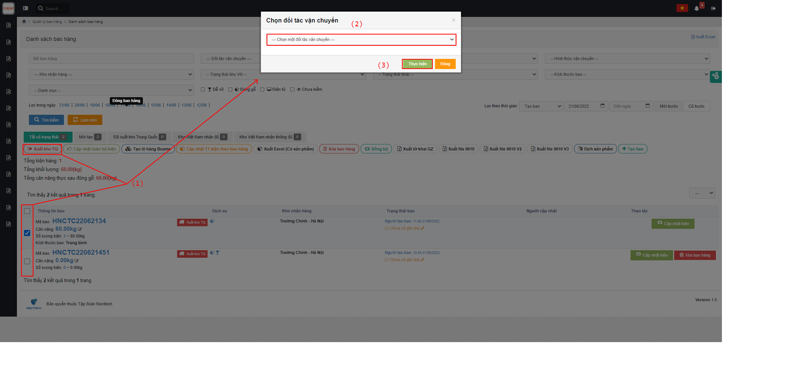

# ☺ Hướng Dẫn Vận Hành Hệ Thống Kho Trung Quốc

## <mark style="color:purple;">**1, Nhập hàng về kho Trung Quốc**</mark>&#x20;

Ở màn <mark style="color:green;">**Danh sách kiện cho kho TQ**</mark> chọn <mark style="color:yellow;">**Mã kiện hàng**</mark> đang ở trạng thái <mark style="color:blue;">**Người bán giao**</mark> => Bấm <mark style="color:red;">**Nhập hàng về kho Trung Quốc**</mark>:&#x20;

&#x20;Sau đó hệ thống sẽ hiển thị 1 pop-up để xác nhận hàng về kho TQ theo kiện .

\=> Nhân viên kho bắn kiện để lấy thông tin:

&#x20;

&#x20;

Pop-up sẽ hiển thị chi tiết thông tin kiện hàng .

\=> Nhân viên kho có nhiệm vụ cân kiện hàng đó lên rồi nhập cân nặng vào và thể tích quy đổi :

&#x20;

&#x20;   &#x20;

\=> Sau khi nhập xong cân nặng, Nhân viên kho sẽ Enter để hoàn thành việc xác nhận về kho TQ như mô tả :


Chú ý :Ở đây có button cập nhật mục đích để nhân viên kho có thể chỉnh sửa lại cân nặng tịnh và cân nặng quy đổi 1 lần nữa. Thêm vào đó :Nv kho có thể nhấn vào mục xem sản phẩm để xem chi tiết sản phẩm.


## <mark style="color:purple;">**2, Tạo bao**</mark>

Bấm <mark style="color:red;">**Tạo bao**</mark> để bắt đầu tạo bao => sẽ hiển thị 1 pop-up <mark style="color:orange;">**Tạo bao**</mark>, điền thông tin Tạo bao (2) => Bấm <mark style="color:red;">**Tạo bao**</mark>&#x20;


Chú ý :

* Nơi nhận bao :Thì phải trùng với kho nhận của kiện hàng
* Mã bao hàng:  Mỗi kho sẽ có nhiều bao hàng,nhưng mã bao hàng lại là duy nhất,nếu đơn hàng đã được tạo thì hệ thống sẽ cảnh báo lỗi .


## <mark style="color:purple;">**3, Cho hàng vào bao**</mark>

Bấm Đóng bao hàng (1) => 1 pop-up để thao tác nhập hàng vào bao (Chọn bao hàng, Chọn kiện hàng cần cho vào bao)(2) => ENTER.

### <mark style="color:purple;">**3.1 Cho được kiện vào bao**</mark>  :

Thì hệ thống sẽ tự động hiện ra chi tiết thông tin kiện hàng:


Tại danh sách kiện đã chọn có 2 thao tác :

1:Thao tác sửa lại cân nặng quy đổi và cân nặng tịnh.

2:Thao tác đưa kiện ra khỏi bao&#x20;


### <mark style="color:purple;">**3.2 Không cho kiện vào bao được**</mark> &#x20;

#### 3.2.1, Kiện hàng chưa được nhân viên kiểm hàng (Nếu Khách hàng chọn dịch vụ Kiểm hàng thì Nhân viên kho phải thực hiện thao tác này ).&#x20;

Hệ thống sẽ hiển thị cảnh báo :"Kiện hàng chưa được kiểm ,hãy kiểm tra lại .

\=> Nhân viên kho lúc này sẽ thao tác kiểm lại kiện hàng này:&#x20;

&#x20;

&#x20;

Hệ thống sẽ hiển thị pop-up kiểm hàng:

&#x20;

#### 3.2.2 Mã kiện hàng không tồn tại:

.png>)

#### 3.2.3 Mã kiện hàng đã tồn tại trong bao,hệ thống sẽ hiển thị Topup dưới đây:

&#x20;&#x20;

## <mark style="color:purple;">**4, Xuất kiện về kho VN**</mark>&#x20;

### <mark style="color:purple;">**4.1, Xuất nhiều bao hàng cùng lúc**</mark>

Ở màn hình <mark style="color:green;">**Danh sách bao hàng**</mark> tích chọn vào Mã bao cần xuất, Bấm <mark style="color:red;">**Xuất kho TQ (1)**</mark> => <mark style="color:red;">****</mark> Hệ thống sẽ hiển thị 1 pop-up <mark style="color:orange;">**Chọn đối tác  vận chuyển về kho Việt Nam**</mark>** **<mark style="color:red;">**(2)**</mark>** **<mark style="color:orange;">****</mark> => Bấm <mark style="color:red;">**Thực hiện**</mark> để hoàn thành <mark style="color:red;">**(3)**</mark>

&#x20;&#x20;

Thao tác này thì trạng thái kiện hàng sẽ chuyển thành <mark style="color:blue;">**Đang vận chuyển TQ-VN**</mark>.

### <mark style="color:purple;">**4.2, Xuất 1 bao duy nhất**</mark>&#x20;

&#x20;Nhân viên kho có thể thực hiện thao tác xuất nhanh về kho Việt Nam bằng cách bấm <mark style="color:red;">**Xuất kho TQ,**</mark> rồi làm tương tự như [xuất nhiều bao](m1.md#4.1-xuat-nhieu-bao-hang-cung-luc).

&#x20;


Đây là thao tác nhanh ,khi hệ thống có nhiều bao hàng mà bên kho chỉ muốn xuất 1 bao duy nhất thì sẽ sử dụng chức năng này.


Khi thực hiện thao tác này thì kiện hàng sẽ chuyển luôn sang trạng thái là "Kho Việt Nam".

