# 🤓 Hướng dẫn kiểm hàng mới và tạo KNNB

## ​​<mark style="color:purple;">1</mark><mark style="color:purple;">**,**</mark> <mark style="color:purple;">**Kiểm hàng mới**</mark>

Trên hệ thống có 2 cách để mở trang Kiểm hàng tại: màn hình <mark style="color:green;">**Danh sách kiện cho kho TQ**</mark>, màn hình <mark style="color:green;">**Danh sách đơn hàng**</mark>**.**

Đối với những đơn hàng có sử dụng dịch vụ <mark style="color:blue;">**Kiểm hàng**</mark> nhân viên kho sẽ cần kiểm hàng khi đơn hàng về kho TQ.

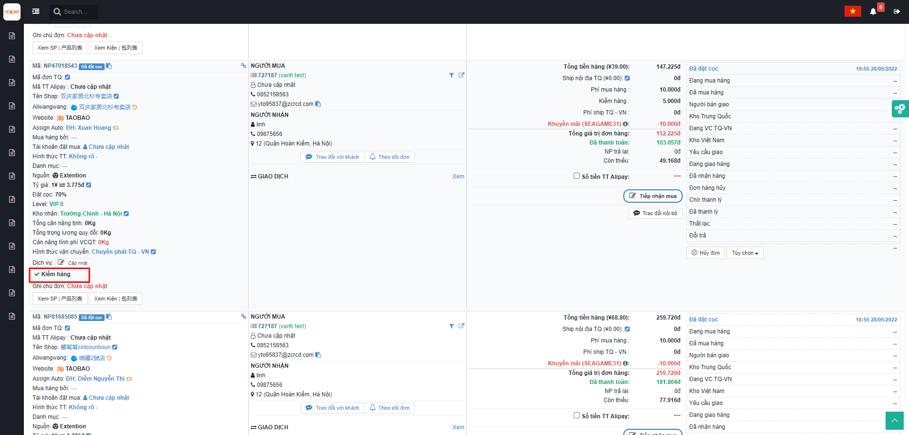

### <mark style="color:purple;">**1.1,**</mark> Tại màn hình <mark style="color:green;">**Danh sách kiện cho kho TQ**</mark>**,** nhân viên kho chọn dịch vụ <mark style="color:blue;">**Kiểm hàng**</mark> => Tìm kiếm ra những đơn cần kiểm:

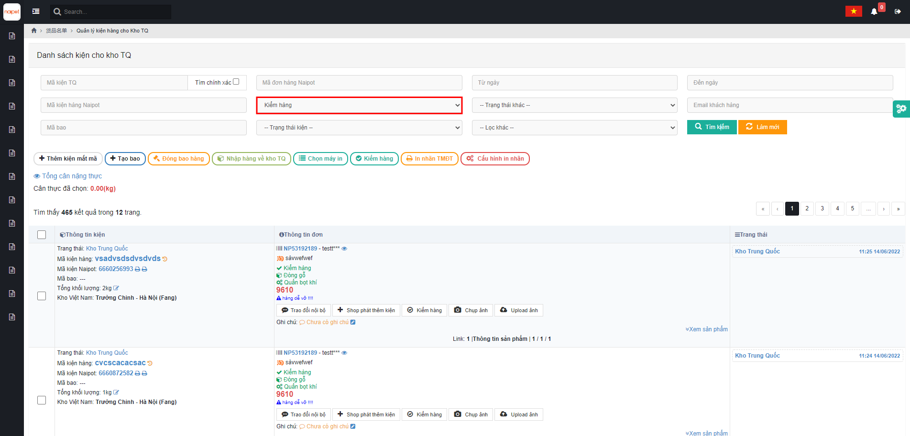

### <mark style="color:purple;">**1.2,**</mark> Bấm vào mục <mark style="color:orange;">**Kiểm hàng**</mark> => Ra màn <mark style="color:green;">**Kiểm hàng theo kiện**</mark> (như hình minh họa bên dưới )

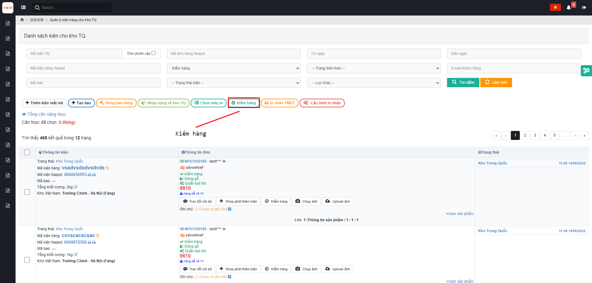

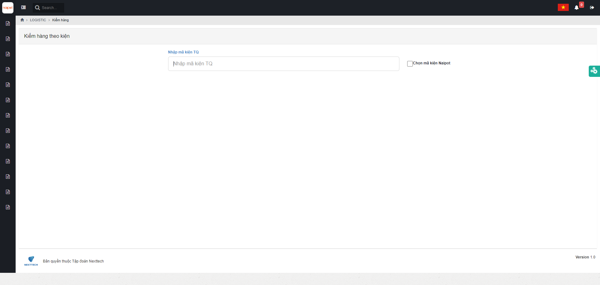

### <mark style="color:purple;">**1.3,**</mark> Tại màn hình này, nhân viên kho bắn mã kiện vào ô => Hệ thống sẽ chuyển sang màn hình <mark style="color:green;">**Chi tiết kiểm hàng**</mark>

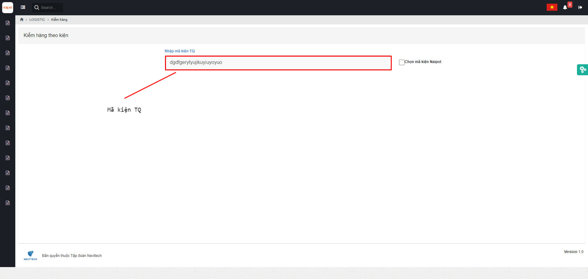

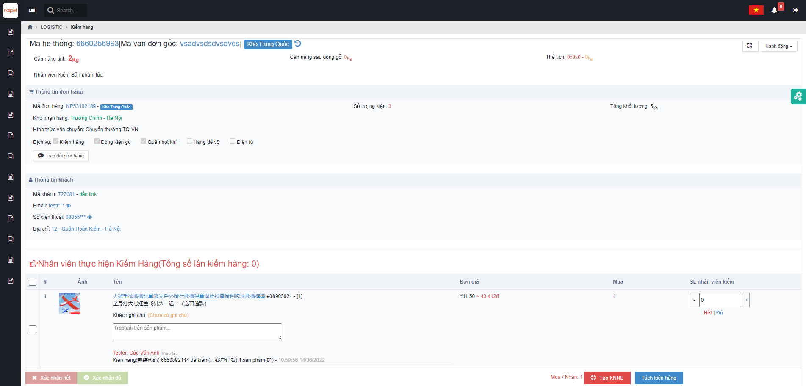

### <mark style="color:purple;">**1.4,**</mark> Tại màn <mark style="color:green;">**Kiểm hàng**</mark> nhân viên kho TQ sẽ điền số lượng đã kiểm vào ô SL nhân viên kiểm

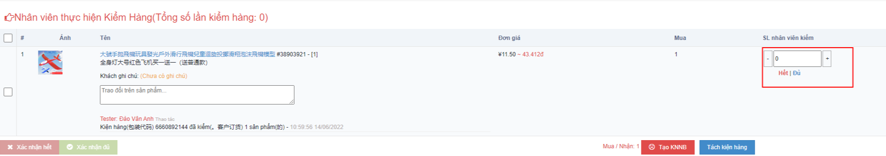


Nếu số lượng sản phẩm đúng với số lượng được đặt mua, nhân viên sẽ nhấn <mark style="color:blue;">**Đủ**</mark> thì số lượng được cập nhật tối đa


Hoặc nhân viên click vào <mark style="color:blue;">**Ô sản phẩm**</mark> và bấm <mark style="color:red;">**Xác nhận đủ**</mark> :thumbsup:

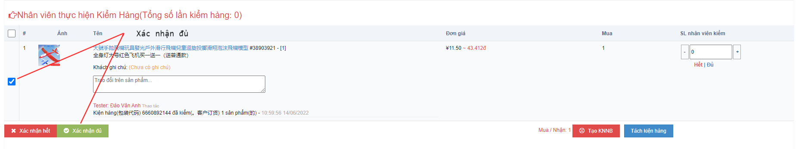


Khi đã kiểm đủ Nhân viên kho hoàn tất quá trình kiểm hàng. Còn trường hợp <mark style="color:blue;">**Số lượng**</mark> thiếu so với <mark style="color:blue;">**Số lượng đặt mua**</mark> => Nhân viên tạo <mark style="color:red;">**KNNB**</mark>.


## <mark style="color:purple;">**2,**</mark> <mark style="color:purple;">**Tạo khiếu nại người bán**</mark>

Nhân viên kho Trung Quốc có thể tạo khiếu nại cho toàn bộ đơn hàng hoặc tạo riêng cho các mã sản phẩm trên đơn trong <mark style="color:green;">**Chi tiết đơn hàng**</mark>, <mark style="color:green;">**Kiểm hàng**</mark> và tại menu khiếu nại trên hệ thống.

### <mark style="color:purple;">**2.1,**</mark> Tại màn hình <mark style="color:green;">**Kiểm hàng**</mark>, đối chiếu **số lượng mua**, **số lượng kiểm** và **ghi chú** (nếu có) (1) => ấn <mark style="color:orange;">**Tạo KNNB**</mark> (2):

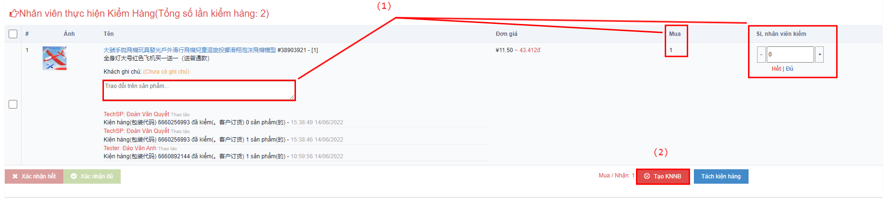

Sau khi bấm <mark style="color:orange;">**Tạo KNBB**</mark>, trên màn hình sẽ xuất hiện 1 trang <mark style="color:green;">**Trang tạo khiếu nại người bán**</mark>:

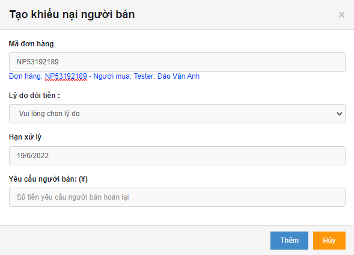

### <mark style="color:purple;">**2.2**</mark>, Ở mục <mark style="color:green;">**Lý do đòi tiền**</mark>, chọn lý do đòi tiền (1) => bấm <mark style="color:red;">**Thêm**</mark> :thumbsup: (2) :

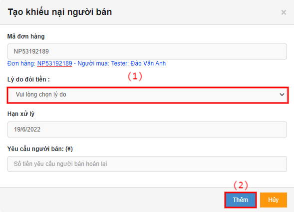

#### &#x20;                                           <mark style="color:green;">Tạo KNNB thành công</mark> :tada: :tada::tada::tada::tada::tada::tada::tada::tada::tada::tada::tada:
