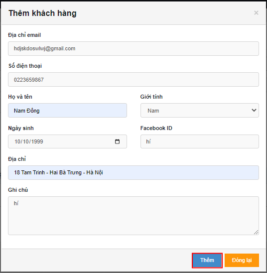
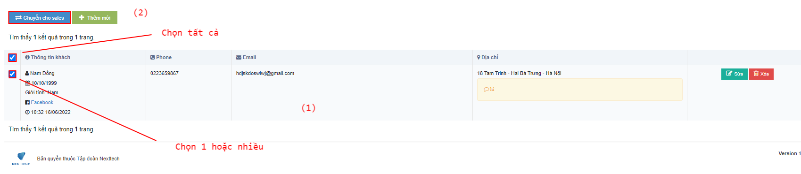
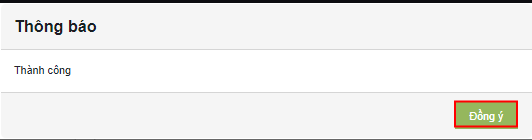

# 😃 Hướng dẫn assign khách cho SALE

## 1, Ở màn <mark style="color:green;">**Danh sách kho Khách hàng**</mark>, bấm <mark style="color:red;">**Thêm mới**</mark> :&#x20;

Pop-up <mark style="color:orange;">**Thêm khách hàng**</mark> hiện ra:

Điền thông tin khách, rồi bấm Thêm. Màn hình thêm khách sau khi xác nhận thành công:

## 2, Ở màn <mark style="color:green;">**Danh sách kho Khách hàng**</mark>, tích chọn đơn hàng <mark style="color:red;">**(1)**</mark> => bấm <mark style="color:red;">**Chuyển cho sale (2)**</mark>:&#x20;

Pop-up hiện ra:&#x20;

Chọn nhân viên Sale <mark style="color:red;">**(1)**</mark> => Bấm <mark style="color:blue;">**OK**</mark> <mark style="color:red;">**(2)**</mark>, màn hình trả về xác nhận và hoàn tất assign:

