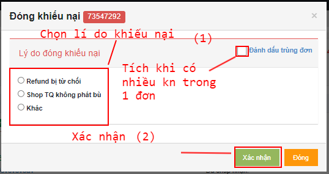
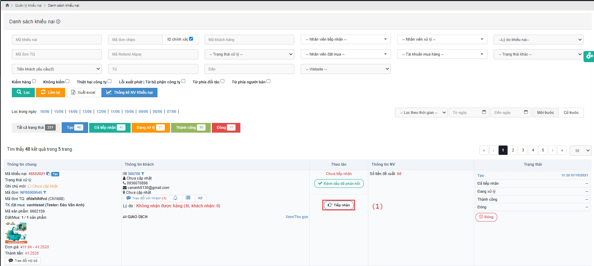
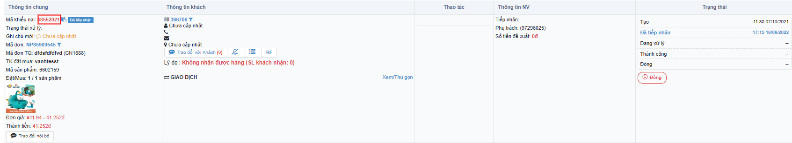
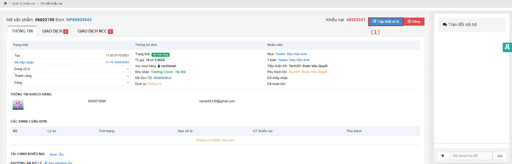

# Hướng dẫn xử lý khiếu nại dịch vụ

Sau khi khách hàng phát sinh khiếu nại dịch vụ, thì nhân viên khiếu nại sẽ tiếp nhận và xử lý khiếu nại đó&#x20;

## <mark style="color:purple;">**1, Đóng khiếu nại**</mark>

### 1.1, Ở màn <mark style="color:green;">**Chi tiết khiếu nại**</mark>, bấm <mark style="color:red;">**Đóng**</mark> :&#x20;

.png>)

Pop-up hiện ra:

Chọn lí do khiếu nại <mark style="color:red;">**(1)**</mark> => Bấm <mark style="color:yellow;">**Xác nhận**</mark> <mark style="color:red;">**(2)**</mark> => <mark style="color:red;">**Thành công**</mark>


Chú ý: Trong 1 đơn hàng mà có nhiều khiếu nại (Khiếu nại trùng đơn thì nhân viên sẽ thao tác đóng lại chỉ để duy nhất 1 khiếu nại và tiến hành xử lý ).Thao tác <mark style="color:red;">**Đóng**</mark> sẽ được sử dụng từ trạng thái <mark style="color:blue;">**Tạo**</mark> đến trạng thái <mark style="color:blue;">**Đang xử lý**</mark>.


<mark style="color:red;">****</mark>

## <mark style="color:purple;">**2, Quy trình xử lý khiếu nại**</mark>

### 2.1, Ở màn <mark style="color:green;">**Danh sách khiếu nại**</mark>, bấm <mark style="color:red;">**Tiếp nhận**</mark> <mark style="color:red;">**(1)**</mark>:

Pop-up xác nhận, bấm <mark style="color:red;">**Đồng ý (2)**</mark>:

.png>)

Bấm <mark style="color:blue;">**Mã khiếu nại**</mark> để vào <mark style="color:green;">**Chi tiết khiếu nại**</mark>:

## 2.2, Ở màn Chi tiết khiếu nại, bấm Cập nhật trạng thái xử lý:


Chú ý:

Đối với trạng thái <mark style="color:blue;">**Shop TQ đã refund**</mark>

Tại màn hình này, chọn Shop TQ đã refund khi được nhà cung cấp hoàn tiền và chọn đúng <mark style="color:blue;">**Mã giao dịch NCC**</mark> như ảnh dưới đây:

&#x20;


