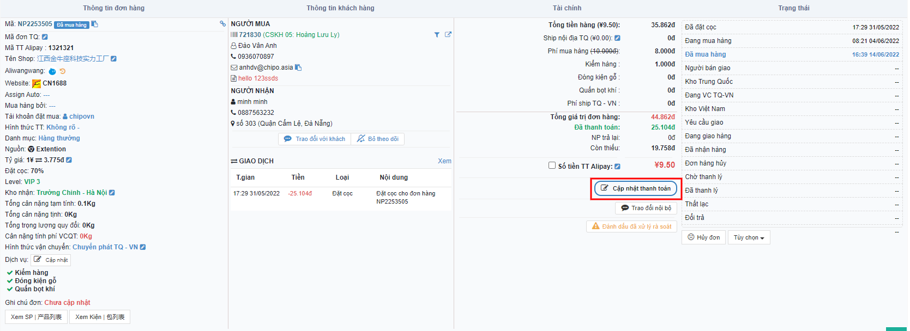
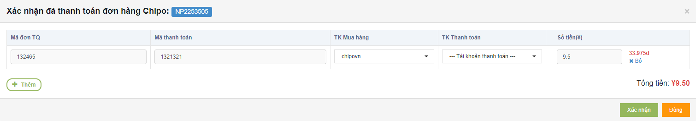

# 😇 Hướng dẫn thanh toán NCC

Sau khi đơn hàng được bên "Mua hàng " đặt mua  thành công trên các sàn TMĐT, đơn hàng sẽ chuyển trạng thái từ <mark style="color:orange;">**Đang Mua Hàng**</mark> sang <mark style="color:orange;">Đã Mua Hàng</mark> .

&#x20;

## <mark style="color:purple;">**1, Thanh toán từng đơn hàng có 1 giao dịch**</mark>&#x20;

### 1.1, Ở màn hình <mark style="color:green;">**Danh sách đơn hàng**</mark>, click vào <mark style="color:red;">**Cập nhật thanh toán**</mark> :

&#x20;

&#x20;

Sau khi click vào <mark style="color:red;">**Cập nhật thanh toán**</mark> thì hệ thống sẽ hiển thị 1 Popup __ 

&#x20;

&#x20;


Chú ý : Nhân viên Mua hàng kết đơn thành công thì bên Popup <mark style="color:orange;">**Xác nhận thanh toán đơn hàng**</mark>  sẽ hiển thị đầy đủ thông tin&#x20;


### &#x20;1.2,  Nhân viên Thanh Toán sẽ chọn <mark style="color:yellow;">**Thêm tài khoản Thanh toán**</mark> ,kiểm tra lại thông tin đơn hàng và <mark style="color:red;">**Xác nhận**</mark> thanh toán .


Chú ý: Nếu Nhân viên Giao dịch cập nhật thiếu Mã giao dịch và Mã thanh toán ,hoặc sai ,nhưng đã vội kết đơn thì đến đây ,nhân viên Thanh toán sẽ taọ thêm  giao dịch mới bằng cách click vào <mark style="color:red;">**Thêm**</mark> trên popup Cập nhật Thanh toán ,hoặc sửa lại thông tin giao dịch .


&#x20;

Sau khi xác nhận thanh toán thành công ,giao dịch NCC của đơn hàng bên <mark style="color:green;">**Danh sách giao dịch nhà CC**</mark>  sẽ chuyển trạng thái từ <mark style="color:blue;">**Chờ Xử Lý**</mark> thành <mark style="color:blue;">**Thành Công**</mark>.

&#x20;


Chú ý : Nếu có trường hợp bất khả kháng xảy ra thì Nhân viên Thanh Toán sẽ sử dụng <mark style="color:blue;">**Đưa về đơn**</mark>**  **<mark style="color:blue;">**Chưa Thanh Toán**</mark> .


## 2, Thanh toán hàng loạt

### 2.1, Thanh toán 1 đơn hàng có nhiều giao dịch&#x20;

&#x20;

Đầu tiên : ta sẽ đi lọc đơn hàng cần thanh toán ,và đánh dấu để thanh toán hàng loạt như hình dưới nhé:  

&#x20;

&#x20;

&#x20;

&#x20; Hệ Thống sẽ tự động hiển thị Popup " Xác nhận thanh toán hàng loạt đơn hàng " 

Chú ý : \* Trạng thái thanh toán : "Cập Nhật " ( Chưa thanh toán )&#x20;

&#x20;

_Tiếp theo ??_

\+ Chọn hình thức thanh toán : Chọn tài khoản thanh toán .

\+ "Xác nhận" thanh toán.

&#x20;

&#x20;

\==> Sau khi thanh toán thành công ,trạng thái thanh toán thành công là:  "Paid "

&#x20;

&#x20;

&#x20;

### 2.2, Thanh toán nhiều đơn hàng cùng 1 lúc .

&#x20;

Đầu Tiên : Ta "Click " vào trạng thái "Chưa Thanh Toán " trên Danh sách đơn hàng  như dưới đây:  

Tiếp theo : "Click " vào đánh dấu "Thanh Toán Hàng Loạt " .

&#x20;

​​​​​​​

Hệ thống sẽ tự động hiển thị "Xác nhận thanh toán đơn hàng hàng loạt " như hình dưới đây ;

Chú ý :

\+ Trạng thái đầu tiên : " Cập nhật " (Chưa thanh toán )

\+ Có thể chọn 1 vài đơn trong tất cả đơn để thanh toán trước . (Những đơn muốn thanh toán thì tích vào ,chưa muốn thanh toán thì bỏ tích )

\+  Chọn hình thức thanh toán : Chọn  " Tài khoản thanh toán "

&#x20;\+ Sau khi thanh toán xong : "Trạng thái thanh toán là thành công " - "Paid "&#x20;

&#x20;

&#x20;

