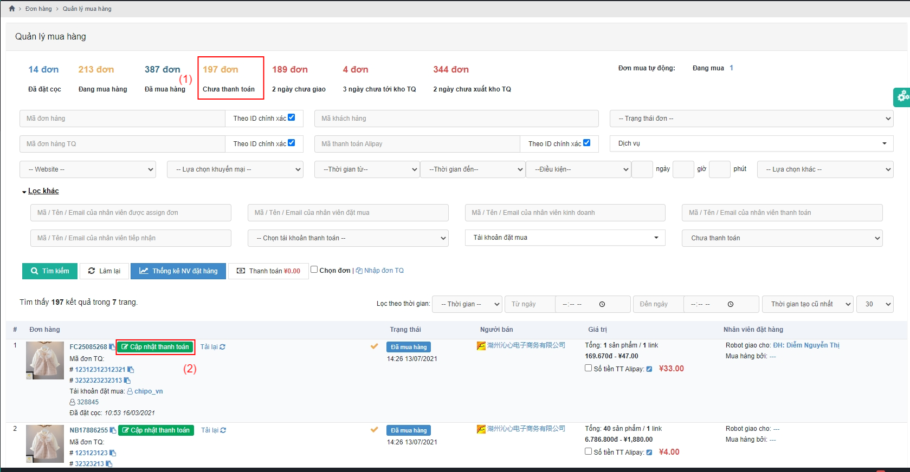
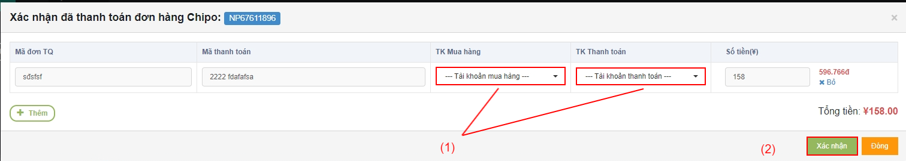
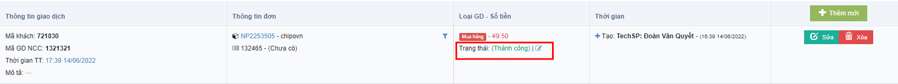
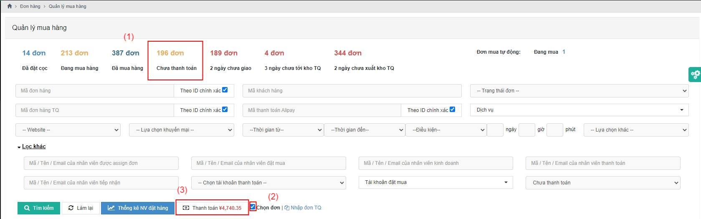

# 😇 Hướng dẫn thanh toán NCC

Sau khi đơn hàng được bên "Mua hàng " đặt mua thành công trên các sàn TMĐT, đơn hàng sẽ chuyển trạng thái từ <mark style="color:orange;">**Đang Mua Hàng**</mark> sang <mark style="color:orange;">**Đã Mua Hàng**</mark> .

## <mark style="color:purple;">**1, Thanh toán từng đơn hàng có 1 giao dịch**</mark>

### 1.1, Ở màn hình <mark style="color:green;">**Quản lý mua hàng**</mark>, chọn <mark style="color:blue;">**Chưa thanh toán**</mark>** **<mark style="color:red;">**(1)**</mark> click vào <mark style="color:red;">**Cập nhật thanh toán**</mark> <mark style="color:red;">(2)</mark> :

Sau khi click vào <mark style="color:red;">**Cập nhật thanh toán**</mark> thì hệ thống sẽ hiển thị 1 Popup <mark style="color:blue;">**Xác nhận đã thanh toán đơn hàng Chipo**</mark> :

Lựa chọn <mark style="color:orange;">T</mark><mark style="color:orange;">**ài khoản Mua hàng**</mark> và <mark style="color:orange;">**Tài khoản Thanh toán**</mark> <mark style="color:red;">**(1)**</mark> => bấm <mark style="color:red;">**Xác nhận**</mark> <mark style="color:red;">**(2)**</mark>

&#x20;                                                     <mark style="color:red;">**THANH TOÁN HOÀN TẤT**</mark> :tada::tada::tada::tada::tada::tada::tada::tada::tada:

### 1.2, Nhân viên Thanh Toán sẽ chọn <mark style="color:yellow;">**Thêm tài khoản Thanh toán**</mark> ,kiểm tra lại thông tin đơn hàng và <mark style="color:red;">**Xác nhận**</mark> thanh toán .


Chú ý: Nếu Nhân viên Giao dịch cập nhật thiếu Mã giao dịch và Mã thanh toán ,hoặc sai ,nhưng đã vội kết đơn thì đến đây ,nhân viên Thanh toán sẽ taọ thêm giao dịch mới bằng cách click vào <mark style="color:red;">**Thêm**</mark> trên popup Cập nhật Thanh toán ,hoặc sửa lại thông tin giao dịch .


Sau khi xác nhận thanh toán thành công ,giao dịch NCC của đơn hàng bên <mark style="color:green;">**Danh sách giao dịch nhà CC**</mark> sẽ chuyển trạng thái từ <mark style="color:blue;">**Chờ Xử Lý**</mark> thành <mark style="color:blue;">**Thành Công**</mark>.


Chú ý : Nếu có trường hợp bất khả kháng xảy ra thì Nhân viên Thanh Toán sẽ sử dụng <mark style="color:blue;">**Đưa về đơn Chưa Thanh Toán**</mark> .


## 2, Thanh toán hàng loạt

### 2.1, Ở màn <mark style="color:green;">**Chi tiết mua hàng**</mark>, làm tương tự bước (1) ở mục 1.1 =>  tích <mark style="color:red;">**Chọn đơn**</mark> <mark style="color:red;">**(2)**</mark> => Click  <mark style="color:red;">**Thanh Toán Hàng Loạt  (3)**</mark> .

​​​​​​​

Hệ thống sẽ tự động hiển thị <mark style="color:orange;">**Xác nhận thanh toán đơn hàng hàng loạt**</mark>  như hình dưới đây :thumbsup:

Chọn hình thức thanh toán (1) => Bấm <mark style="color:red;">**Xác nhận**</mark> (2):&#x20;

.png>)

Màn hình trả về:&#x20;


Chú ý :Có thể chọn 1 vài đơn trong tất cả đơn để thanh toán trước . (Những đơn muốn thanh toán thì tích vào ,chưa muốn thanh toán thì bỏ tích ).


<mark style="color:red;">****</mark>

<mark style="color:red;">****</mark>

&#x20;                                                <mark style="color:red;">**THANH TOÁN HOÀN TẤT**</mark> :tada::tada::tada::tada::tada::tada::tada::tada::tada:

