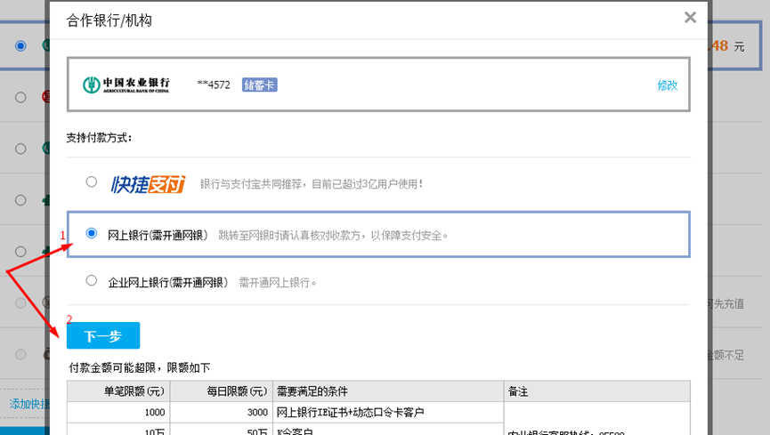

# 😇 Hướng dẫn thanh toán NCC

Sau khi đơn hàng được bên "Mua hàng " đặt mua thành công trên các sàn TMĐT, đơn hàng sẽ chuyển trạng thái từ <mark style="color:orange;">**Đang Mua Hàng**</mark> sang <mark style="color:orange;">**Đã Mua Hàng**</mark> .


Chú ý: Có thể chọn 1 vài đơn trong tất cả đơn để thanh toán trước. (Những đơn muốn thanh toán thì tích vào, chưa muốn thanh toán thì bỏ tích).


## **1, THANH TOÁN TỔNG HỢP**

### **1.1,  Lọc đơn cần Thanh toán ở màn Quản lý mua hàng**

Bấm <mark style="color:yellow;">**Chưa thanh toán**</mark>  => Lựa chọn các tài khoản có đơn cần thanh toán.

.png>)

### **1.2,  Đăng nhập tài khoản TQ (Thao tác bên Tab trang web TQ)**

Đăng nhập vào tài khoản TQ tương ứng với TK đã được chọn để thanh  toán ở [**1.1**](m1.md#1.1-loc-don-can-thanh-toan-o-man-quan-ly-mua-hang) **=>**Chọn Tab <mark style="color:red;">**待付款**</mark> (Chưa thanh toán ) => Chọn <mark style="color:red;">**Sao chép mã đơn**</mark>.

.png>)

### **1.3, Xác nhận mã đơn TQ được thanh toán (Thao tác trên Tab hệ thống)**

Chọn icon Copy-Paste&#x20;

.png>)

Paste những mã đơn TQ vừa copy vào khung nhập số liệu **=>** chọn <mark style="color:red;">**Xác nhận**</mark>. Khi đó hệ thống sẽ tự động chọn các đơn hàng có mã đơn TQ trùng khớp.

.png>)

Chọn <mark style="color:red;">**Thanh toán**</mark>

.png>)

Chọn icon Copy-Paste và lưu ý tổng số đơn <mark style="color:red;">**(1)**</mark>  và số tiền <mark style="color:red;">**(2)**</mark> tại đây để lấy cơ sở so sánh.

.png>)

### **1.4, Kiểm tra tính chính xác về số lượng. (Thao tác trên Tab web TQ)**

Paste mã đơn TQ vừa copy ở thao tác trên vào ô nhập dữ liệu =>Chọn <mark style="color:red;">**Tự động chọn đơn**</mark>. Tại đây sẽ kiểm tra được số đơn trùng khớp để so sánh điều kiện <mark style="color:red;">**(1)**</mark> .

.png>)

·         Nếu số đơn trùng khớp => Chọn Thanh toán tổng hợp <mark style="color:red;">**合并付款**</mark>  đến [**1.5**](m1.md#1.5-kiem-tra-tinh-chinh-xac-ve-so-tien.-thao-tac-ben-tab-web-tq)****

.png>)

·         Nếu số đơn lệch -> Kiểm tra lại từng mã xem mã còn thiếu là mã nào. Và bỏ đi mã đó tương ứng bên Tab hệ thống.&#x20;

.png>)

·         Đơn không có bên trang web TQ có thể do Đơn đã bị <mark style="color:blue;">**Đóng**</mark> hoặc <mark style="color:blue;">**Đơn bắt buộc yêu cầu thanh toán lẻ**</mark>.

Nếu do đơn bị đóng => báo GD kiểm tra và đặt lại.

Nếu do đơn yêu cầu thanh  toán riêng => Xem quy trình [**Thanh toán đơn lẻ**](m1.md#2.-thanh-toan-don-le).

Đơn bị thanh toán thừa : Nhân viên  thanh toán chịu TN 100% giá trị thanh toán

### **1.5, Kiểm tra tính chính xác về số tiền. (Thao tác bên Tab web TQ)**

Nếu sai số tiền. Yêu cầu kiểm tra lại số tiền của từng mã đơn hàng TQ để biết được đơn nào bị lệch => Báo GD kiểm tra.

Nếu trùng khớp số tiền => Chọn phương thức thanh toán.

Đơn bị thanh toán sai số tiền : Nhân viên  thanh toán chịu TN giá trị thanh toán chênh lệch.

#### **1.5.1, Thanh toán qua Alipay. Nếu số dư Alipay còn đủ để thanh toán.**

·         Chọn phương thức <mark style="color:yellow;">**账户余额**</mark> (Số dư Tài khoản) và Nhập <mark style="color:yellow;">**Mã Thanh toán**</mark>  <mark style="color:yellow;">**nhanh**</mark> để thanh toán.&#x20;

.png>)

Hệ thống sẽ báo thành công nếu nhập đúng mã. Sau đó đến [**1.8**](m1.md#8.-buoc-8-hoan-thanh-thanh-toan-.-thao-tac-tren-tab-he-thong)****

.png>)

#### **1.5.2, Thanh toán bằng Ngân hàng**&#x20;

·         Chọn phương thức <mark style="color:yellow;">**中国农业银行**</mark> (Ngân hàng Nông nghiệp TQ - ABC) và chọn <mark style="color:yellow;">**添加快捷/网银付款**</mark> (Thêm ngân hàng thanh toán) và đến **** [**1.6**](m1.md#1.6-xac-nhan-thong-tin-ngan-hang-thanh-toan.-thao-tac-ben-tab-web-tq)****

.png>)

### **1.6, Xác nhận thông tin ngân hàng Thanh toán. (Thao tác bên Tab web TQ)**

·         Sau khi kiểm tra các điều kiện hợp lệ ở [1.3](m1.md#1.3-xac-nhan-ma-don-tq-duoc-thanh-toan-thao-tac-tren-tab-he-thong) và [1.4](m1.md#1.4-kiem-tra-tinh-chinh-xac-ve-so-luong.-thao-tac-tren-tab-web-tq).

Nhập số tài khoản ngân hàng ABC tương ứng đang dùng để thanh toán tại đây

.png>)

·         Lựa chọn phương thức thanh toán là <mark style="color:yellow;">**网上银行**</mark> ( Ngân hàng trực tuyến ) => chọn<mark style="color:yellow;">**下一步**</mark> (Bước tiếp theo)&#x20;

Chọn <mark style="color:yellow;">**登录到网上银行付款**</mark> (Đăng nhập vào ngân hàng) để tiến hành bước thanh toán&#x20;

.png>)

Copy Link thanh toán và đến [**1.7**](m1.md#1.7-thuc-hien-thanh-toan.)****

&#x20;****&#x20;

.png>)

### **1.7, Thực hiện Thanh toán.**

Paste Link vừa Copy được sang trình duyệt => Chọn <mark style="color:blue;">**K宝/K令支付**</mark> sau đó chọn<mark style="color:blue;">**下一步**</mark> (Tiếp theo)&#x20;

.png>)

Chọn đúng STK ngân hàng đang dùng để thanh toán <mark style="color:red;">**(1)**</mark> => Nhập mã thanh toán của Ngân hàng <mark style="color:red;">**(2)**</mark> => Cuối cùng chọn <mark style="color:red;">**Thanh toán**</mark> <mark style="color:red;">**(3**</mark>)&#x20;

.png>)

Xác nhận bấm <mark style="color:red;">**OK**</mark> trên Token.

.png>)

·         Ngân hàng xác nhận thanh toán thành công => đến [1.8](m1.md#1.8-hoan-thanh-thanh-toan-.-thao-tac-tren-tab-he-thong)

.png>)

&#x20;****&#x20;

### **1.8, Hoàn thành thanh toán . (Thao tác trên Tab hệ thống)**

·         Quay về Tab hệ thống đang dừng ở màn hình [**1.3**](m1.md#1.3-xac-nhan-ma-don-tq-duoc-thanh-toan-thao-tac-tren-tab-he-thong)****

·         Chọn Ngân hàng đã dùng để thanh toán và chọn <mark style="color:red;">**Xác nhận**</mark> để hoàn thành thanh toán

.png>)

## **2. THANH TOÁN ĐƠN LẺ**

### **2.1, Chọn đơn cần thanh toán**

·         Vào hệ thống chọn đơn cần thanh toán và click vào mã đơn TQ.&#x20;

.png>)

### **2.2, Kiểm tra số tiền**

Tài khoản TQ và kiểm tra số tiền trên đơn xem đã chính xác chưa

1,Nếu sai – báo GD kiểm tra lại

2, Nếu đúng -  Chọn <mark style="color:yellow;">**付款**</mark> (Thanh toán)&#x20;

.png>)

### **2.3, Tiến hành thanh toán**

·         Làm như 1.4 đến 1.7 của Quy trình Thanh toán tổng hợp

### **2.4, Cập nhật thanh toán**

Sau khi thanh toán thành công với bên TQ. Quay về hệ thống, chọn <mark style="color:red;">**Cập nhật Thanh toán**</mark>&#x20;

.png>)

·         Chọn TK vừa dùng để  thanh toán và <mark style="color:red;">**Xác nhận**</mark>

.png>)

&#x20;                                                <mark style="color:red;">**THANH TOÁN HOÀN TẤT**</mark> :tada::tada::tada::tada::tada::tada::tada::tada::tada:

