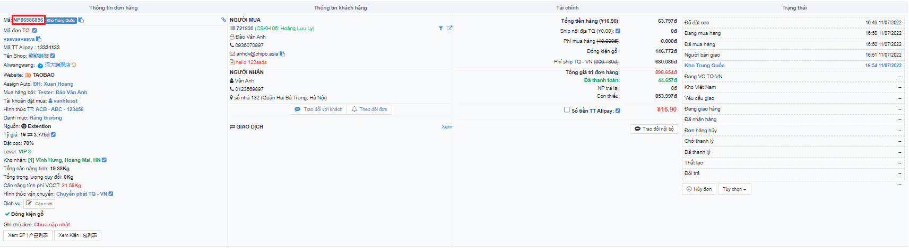
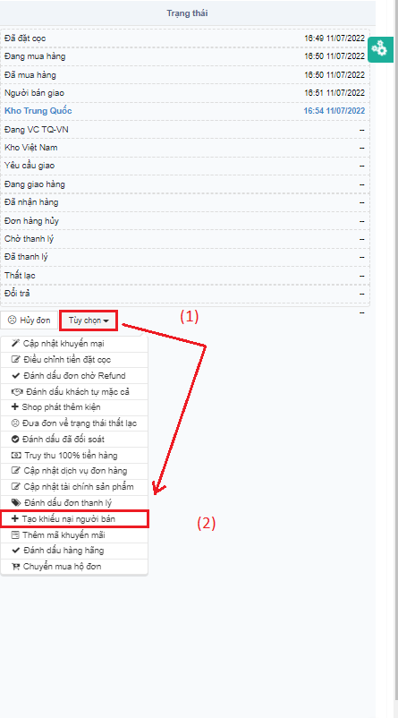
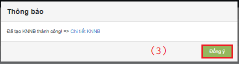

# 🙃 Hướng dẫn tạo KNNB

Trên hệ thống có 2 cách để tạo KNNB tại: màn hình <mark style="color:green;">**Danh sách đơn hàng**</mark>, màn hình <mark style="color:green;">**Chi tiết**</mark>** **<mark style="color:green;">**đơn hàng**</mark>**.**

## <mark style="color:purple;">**1**</mark>**. Ở màn **<mark style="color:green;">**Danh sách đơn hàng**</mark>**, bấm vào **<mark style="color:red;">**mã đơn Naipot**</mark>**:**

Cửa sổ hệ thống tự động chuyển sang màn <mark style="color:green;">**Chi tiết đơn hàng**</mark>:

.png>)

## <mark style="color:purple;">**2**</mark>. Ở màn <mark style="color:green;">**Chi tiết đơn hàng**</mark>, bấm <mark style="color:red;">**Tùy chọn (1)**</mark> => <mark style="color:red;">**Tạo KNNB (2)**</mark>:

Pop-up <mark style="color:blue;">**Tạo khiếu nại người bán**</mark>:


Lý do tạo KNNB ở màn hình của nhân viên đặt hàng:

* Đơn lâu không phát cần hoàn tiền.
* Đơn cần trả hàng (Khách không dùng dịch vụ kiểm hàng)
* Đơn kho còn sót nhưng không tạo KNNB


Nhân viên Đặt hàng kiểm tra và điền thông tin ( <mark style="color:orange;">**vùng màu cam**</mark>), đặc biệt Lý do đòi tiền là bắt buộc (<mark style="color:red;">vùng màu đỏ</mark>) (1) => bấm <mark style="color:red;">**Thêm (2)**</mark> => Xác nhận <mark style="color:red;">**Đồng ý (3)**</mark>:


Có thể truy cập Chi tiết KNNB trên Thông báo xác nhận.

