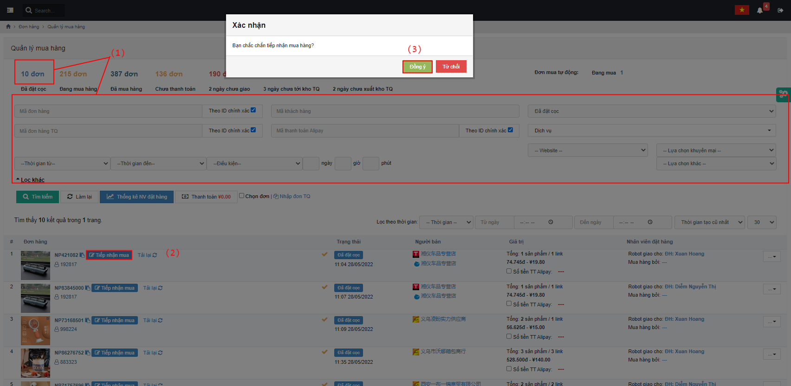
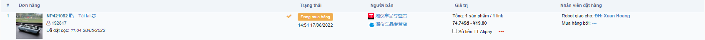
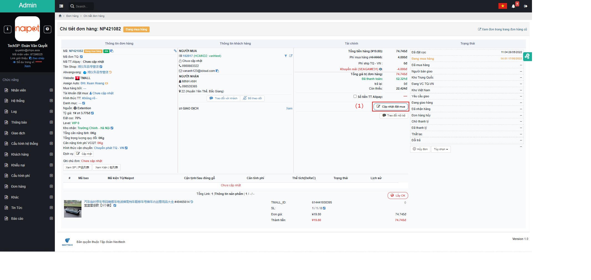
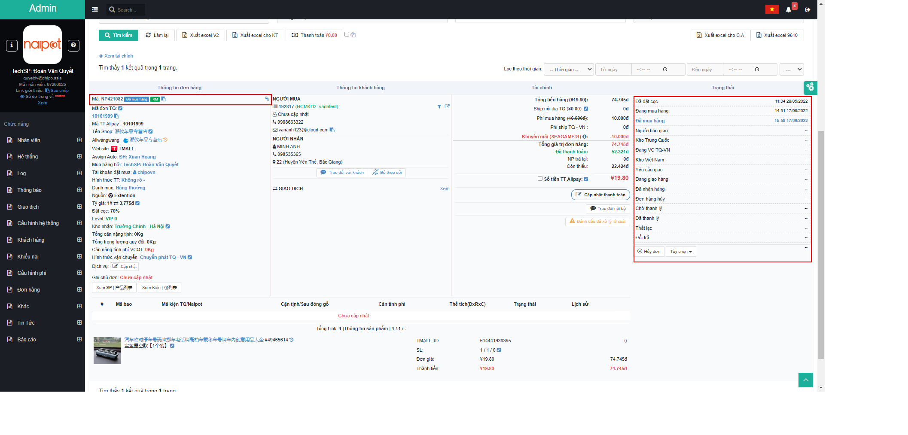

# 😀 Hướng dẫn xử lý mua hàng

## 1, Ở màn <mark style="color:green;">**Quản lý mua hàng**</mark>, bấm <mark style="color:blue;">**Đơn đã đặt cọc**</mark> hoặc lọc thông tin <mark style="color:red;">**(1)**</mark> => bấm <mark style="color:red;">**Tiếp nhận mua**</mark> <mark style="color:red;">**(2) =>**</mark> Xác nhận <mark style="color:red;">**Đồng ý (3)**</mark>

Màn hình tiếp nhận thành công:


Bấm vào <mark style="color:blue;">**Mã đơn hàng**</mark> để chuyển qua <mark style="color:green;">**Chi tiết đơn hàng**</mark> để <mark style="color:red;">**Cập nhật đặt mua**</mark>.


## 2, Ở màn <mark style="color:green;">**Chi tiết đơn hàng**</mark>, bấm <mark style="color:red;">**Cập nhật đặt mua (1)**</mark> => Điền thông tin <mark style="color:red;">**(2)**</mark> => bấm <mark style="color:red;">**Xác nhận mua hàng (3)**</mark>=> Xác nhận <mark style="color:red;">**Đồng ý (4)**</mark>


Chú ý: Trong trường hợp có nhiều giao dịch, sử dụng chức năng <mark style="color:red;">**Thêm GD**</mark>


Sau khi đặt hàng thành công, đơn hàng tự động chuyển sang trạng thái <mark style="color:blue;">**Đã mua hàng**</mark>:

