# 🧐 Hướng dẫn quản lý phương án xử lý

## <mark style="color:purple;">**1.**</mark> <mark style="color:purple;">**`Xử lý đơn KNNB`**</mark>

Nhân viên đặt hàng có thể tạo Phương án giải quyết ở <mark style="color:green;">**Chi tiết KNNB**</mark> và <mark style="color:green;">**Danh sách Phương án giải quyết hàng hóa**</mark>**.**

### <mark style="color:purple;">**1.1**</mark> , Tại <mark style="color:green;">**Khiếu nại người bán**</mark>: Nhân viên đặt hàng có thể lọc search theo các điều kiện có trên đầu trang:

* Trạng thái xử lý.
* Tài khoản mua hàng, nhân viên mua hàng
* Tìm kiếm theo mã khiếu nại, mã đơn hàng hoặc mã sản phẩm, ….

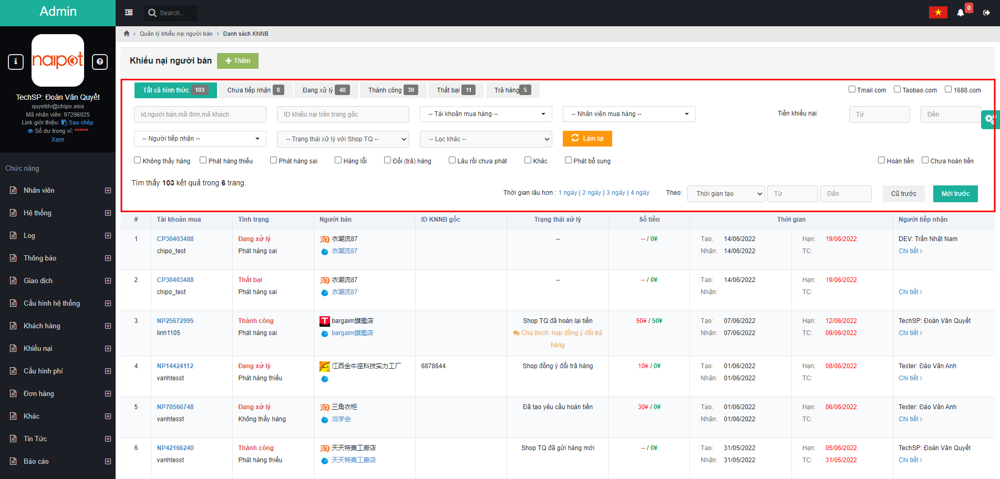

Sau khi lọc xong, bấm <mark style="color:red;">**Tiếp nhận**</mark> :clap:, xác nhận <mark style="color:red;">**Đồng ý**</mark> :thumbsup::

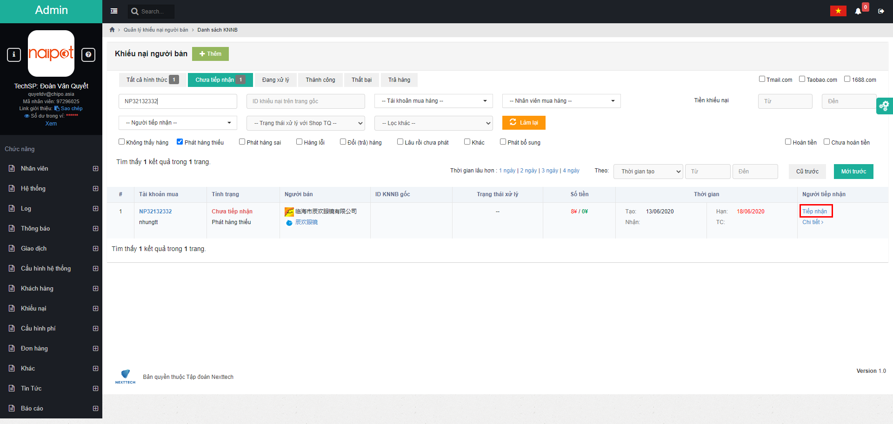

Bấm <mark style="color:red;">**Chi tiết**</mark> :smile: để di chuyển sang trang <mark style="color:green;">**Chi tiết KNNB**</mark>:

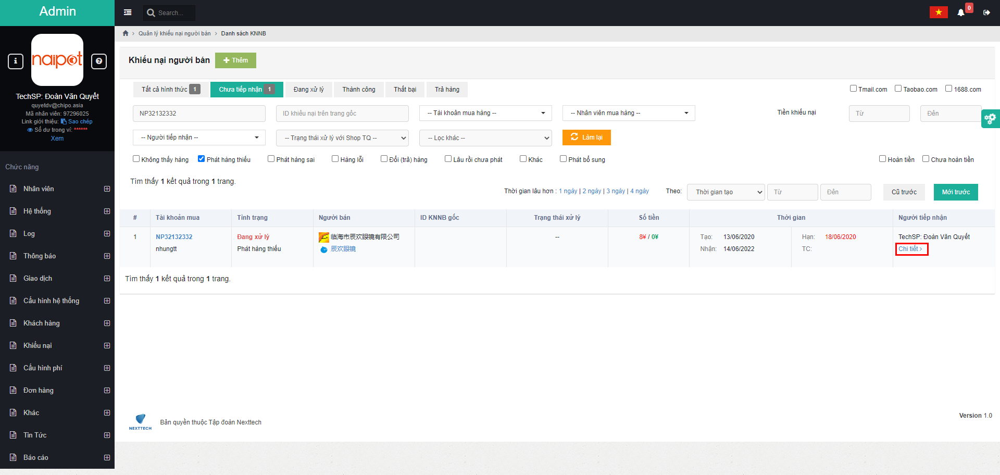

### <mark style="color:purple;">**1.2**</mark>, Ở màn <mark style="color:green;">**Chi tiết KNNB**</mark>, bấm chọn <mark style="color:orange;">**Cập nhật xử lý**</mark> => Lựa chọn <mark style="color:blue;">**Cập nhật**</mark> => bấm <mark style="color:red;">**Cập nhật xử lý**</mark> :joy:, xác nhận <mark style="color:red;">**Đồng ý**</mark> :thumbsup:.

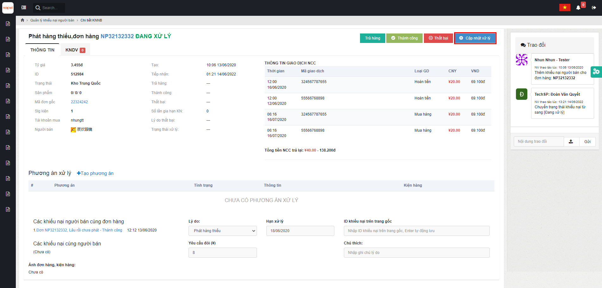

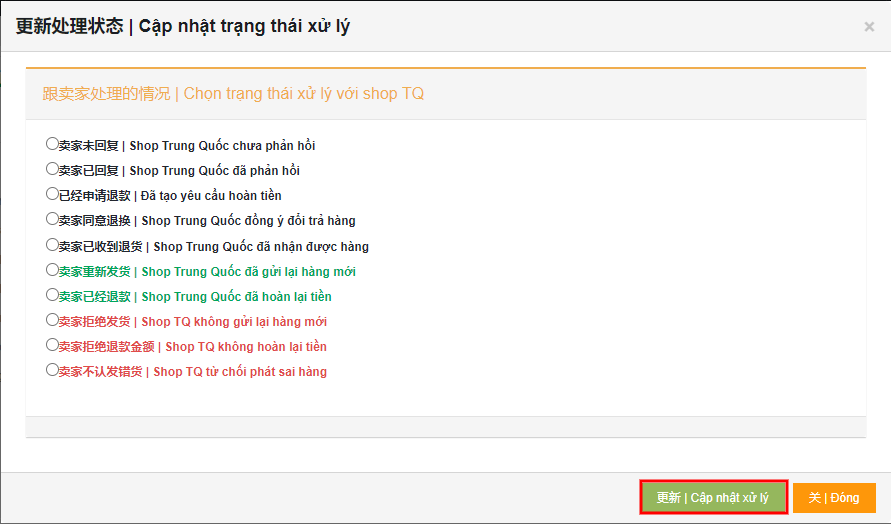

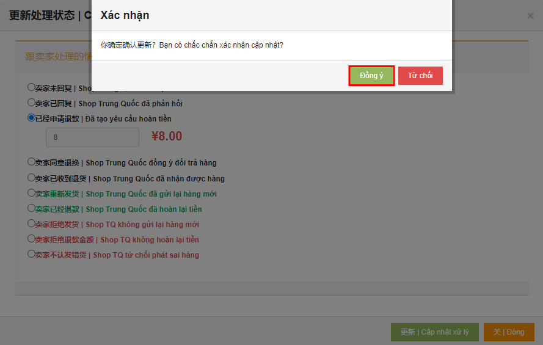

\\

## <mark style="color:purple;">**2. Trả hàng**</mark>

### <mark style="color:purple;">**2.1,**</mark> Tại màn hình <mark style="color:green;">**Chi tiết KNNB**</mark> bấm chọn  <mark style="color:orange;">**Tạo phương án**</mark>, bấm <mark style="color:orange;">**Trả hàng**</mark>:

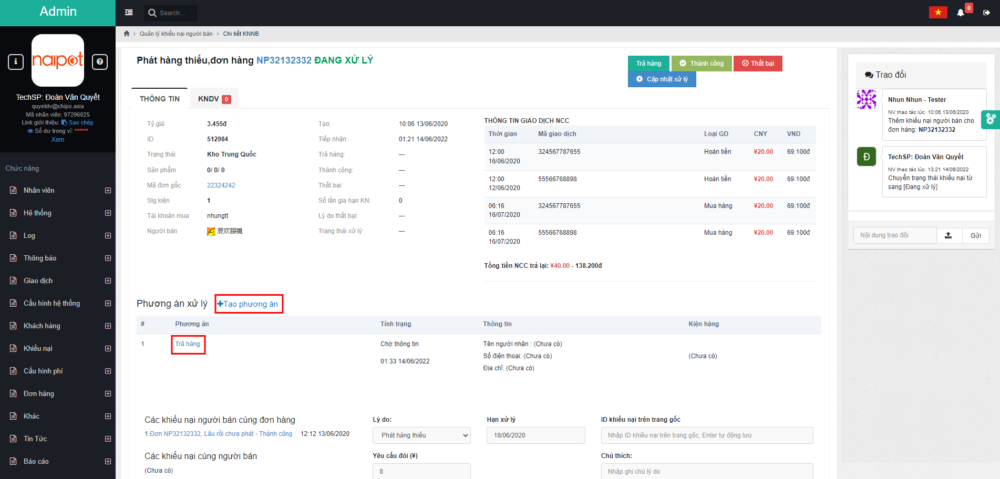

Màn hình tự động mở cửa sổ <mark style="color:green;">**Chi tiết phương án KNNB**</mark> đơn <mark style="color:blue;">**Mã đơn hàng**</mark> :

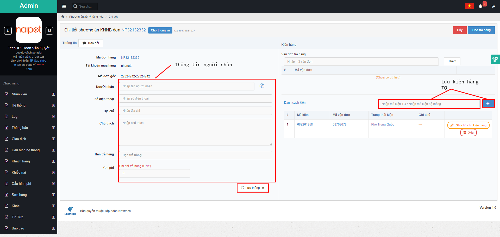

### <mark style="color:purple;">**2.2,**</mark> Cập nhật thông tin <mark style="color:blue;">**Người nhận**</mark>, <mark style="color:blue;">**Danh sách kiện**</mark> bấm <mark style="color:red;">**Lưu thông tin**</mark>, xác nhận <mark style="color:orange;">**Lưu**</mark> và hệ thống tự chuyển trạng thái <mark style="color:blue;">**Chờ trả hàng**</mark>:

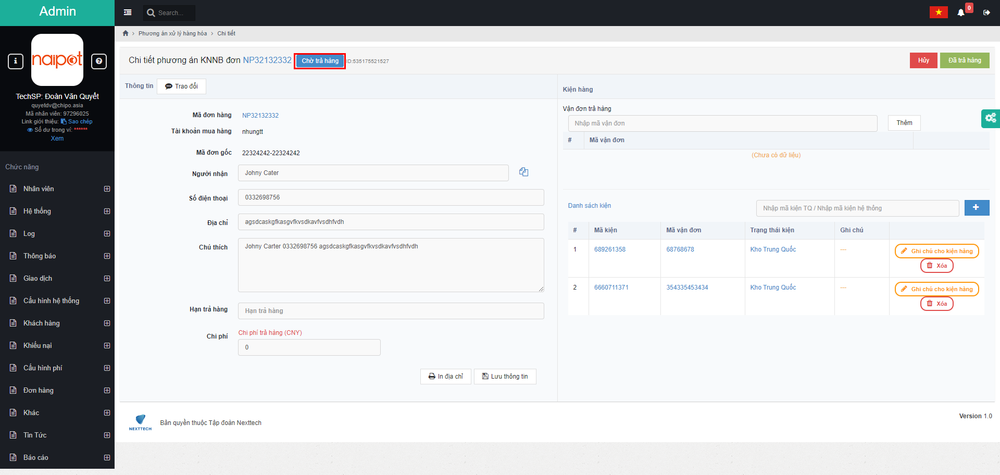

Phát đơn hàng về Trung Quốc, nhân viên đặt hàng liên hệ với chủ shop, sau khi xác nhận là đã nhận được hàng thì điền <mark style="color:blue;">**Mã vận đơn**</mark>:

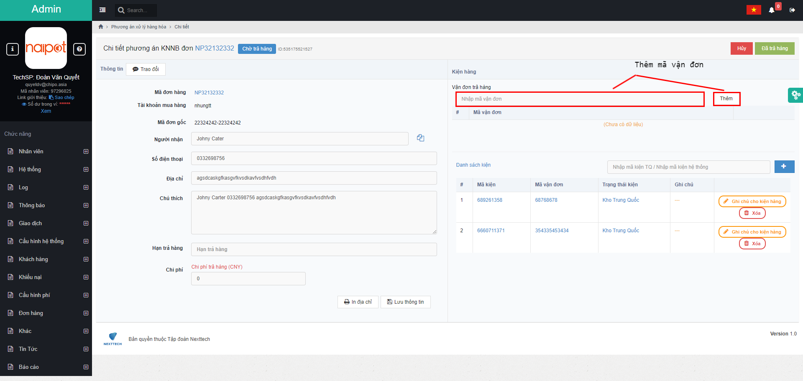

Sau khi xác nhận trả hàng, trạng thái sẽ chuyển sang <mark style="color:blue;">**Đã trả hàng**</mark>:

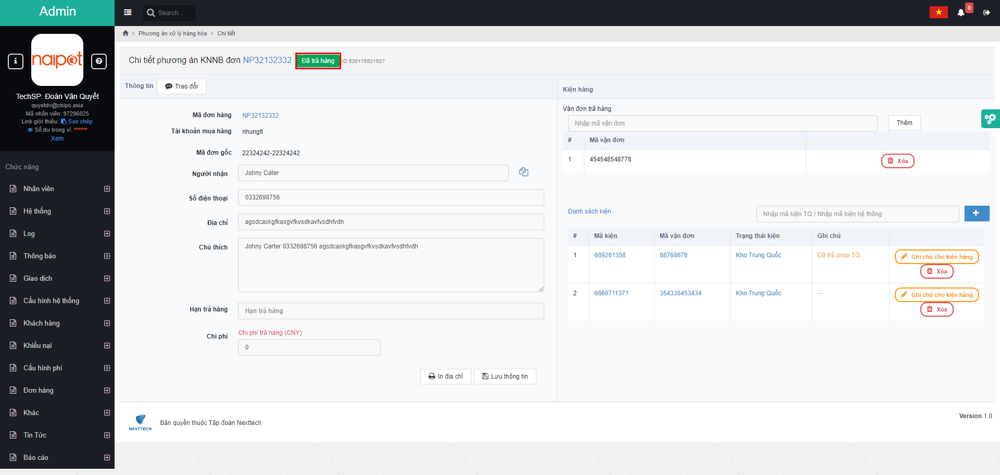

### <mark style="color:purple;">**2.3,**</mark> Quay trở lại màn <mark style="color:green;">**Chi tiết KNNB**</mark>, bấm Cập nhật xử lý => chọn Shop Trung Quốc đã gửi lại hàng mới => Nhập <mark style="color:blue;">**Mã vận đơn**</mark> => bấm <mark style="color:orange;">**Cập nhật xử lý**</mark>:

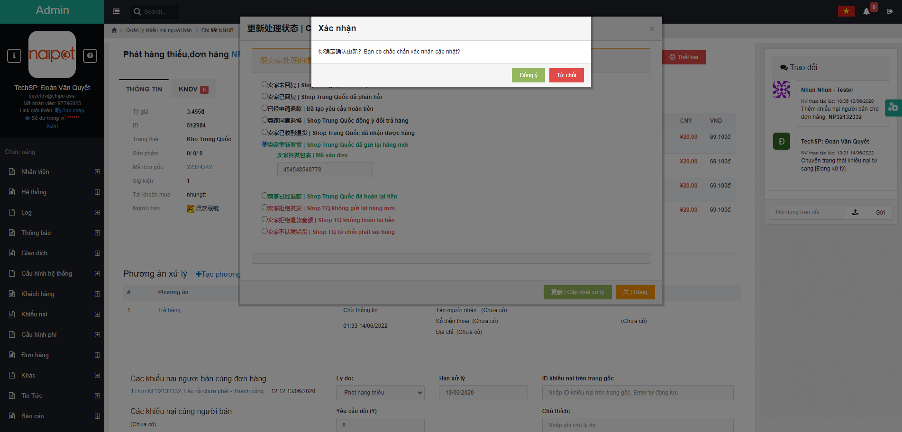

Xác nhận cập nhật => Kết thúc khiếu nại người bán.

Màn hình thành công:

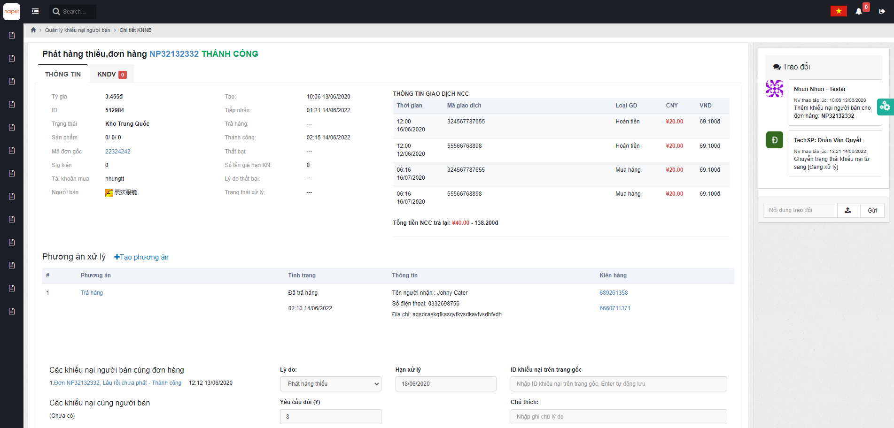
