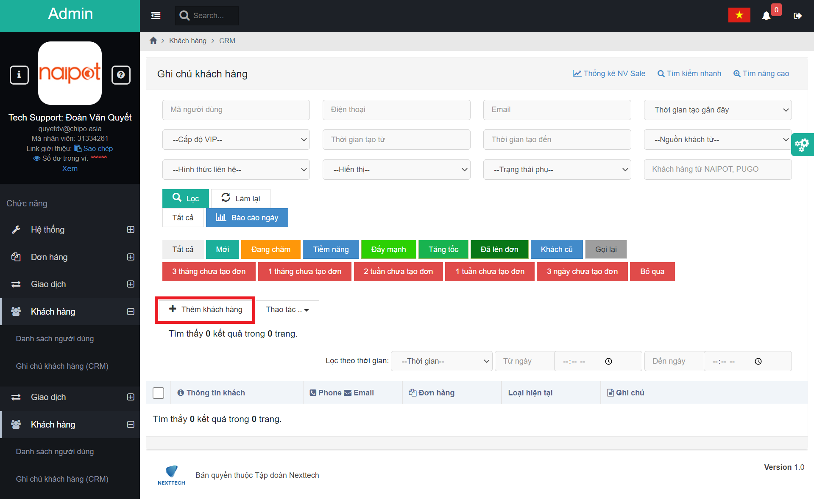
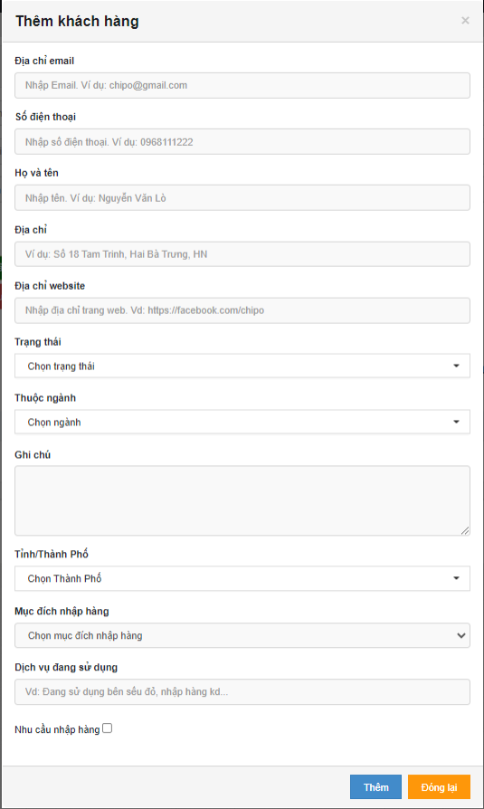
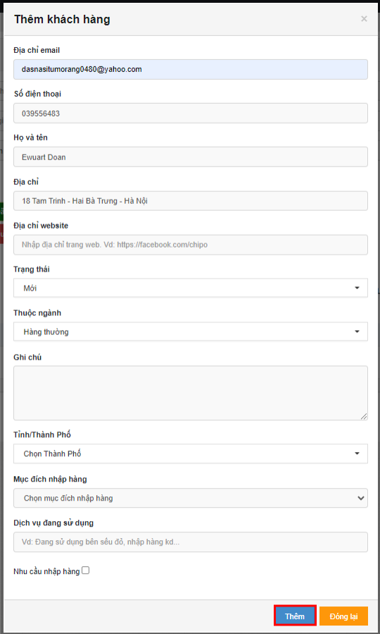
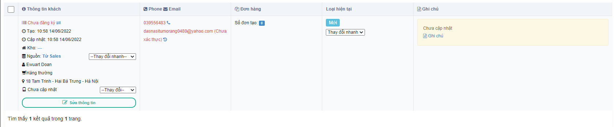
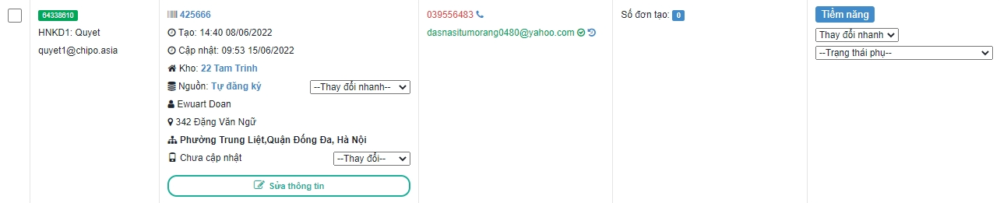

# 😆 Hướng Dẫn Thêm Khách Hàng

## <mark style="color:purple;">1, Thêm khách hàng</mark>

\- Nhân viên sale có nhiệm vụ tìm kiếm khách hàng thông qua các nguồn khác nhau và nhập thông tin khách hàng trên trang CRM.

### <mark style="color:purple;">**1.1,**</mark> Tại màn hình <mark style="color:green;">**CRM**</mark> Sale bấm <mark style="color:red;">**Thêm Khách Hàng**</mark> :

Hệ thống sẽ tự động hiển thị popup <mark style="color:orange;">**Thêm thông tin khách hàng**</mark> như hình dưới đây :thumbsup: :

### <mark style="color:purple;">**1.2**</mark>, Điền các trường thông tin (<mark style="color:blue;">**Địa chỉ email**</mark>, <mark style="color:blue;">**Số điện thoại**</mark> là thông tin bắt buộc) => Click vào <mark style="color:red;">**Thêm**</mark> để thêm khách hàng:

Màn hình <mark style="color:green;">**Thêm khách hàng thành công**</mark>:

.png>)

Click <mark style="color:blue;">**Đồng ý**</mark>, cửa sổ chuyển sang màn hình như bên dưới:

Tới đây ta thấy trạng thái khách hàng đang là <mark style="color:blue;">**Chưa Đăng Ký**</mark>

Công việc sau đó của Sale là : Gọi điện tư vấn cho khách để khách đăng ký tài khoản Naipot và kích hoạt tài khoản Naipot . Hệ thống Mail tự động gửi mail xác thực cho khách, trong trường hợp có sự cố, Sale sẽ gửi mail xác thực cho khách.

Tài khoản sau khi xác thực:


Nếu khi khách đăng ký thành công ,mà trong CRM nhân viên cũng thêm khách hàng trước đó ,thì khách hàng này sẽ được <mark style="color:blue;">**Assign**</mark> cho Sale đó chăm sóc ,và tư vấn cho khách lên đơn ở các bước tiếp theo nữa.



Ở <mark style="color:yellow;">**Loại hiện tại**</mark>, nếu thay đổi trạng thái thì không thì thể trở lại trạng thái <mark style="color:blue;">**Mới**</mark>.


##
