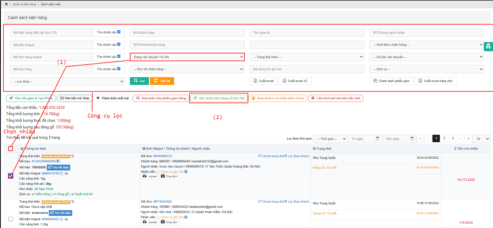
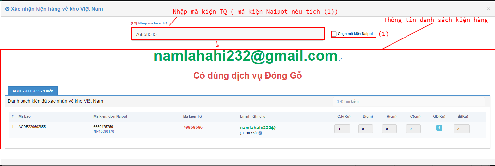

# 🥲 Hướng dẫn nhập hàng về kho VN


Sau khi hàng được vận chuyển từ Trung Quốc về đến kho Việt Nam, Nhân viên kho Việt Nam sẽ tiến hành nhận hàng và thao tác nhận hàng trên hệ thống trên màn hình <mark style="color:green;">**Danh sách kiện hàng**</mark>. Muốn đưa kiện hàng về kho Việt Nam, thì trước đó kiện hàng sẽ ở trạng thái  <mark style="color:blue;">**Đang vận chuyển Trung Quốc - Việt Nam**</mark>.


## 1, <mark style="color:purple;">**Luồng có mã**</mark>&#x20;

### 1.1, Ở màn <mark style="color:green;">**Danh sách kiện hàng**</mark> Nhân viên kho VN sẽ tiến hành chọn kiện hàng muốn đưa về và  đang ở trạng thái <mark style="color:blue;">**Đang vận chuyển TQ-VN**</mark> <mark style="color:red;">**(1)**</mark>** ** => Bấm <mark style="color:red;">**Xác nhận kiện hàng về kho Việt Nam**</mark> <mark style="color:red;">**(2)**</mark>.

&#x20;

Hệ thống tự động hiển thị lên popup Xác nhận kiện hàng về kho Việt Nam:&#x20;

&#x20;

&#x20;

&#x20;


Chú ý: Trong popup cũng thể hiện 2 chi tiết :

\+ Số kiện hàng có trong bao

\+Số kiện hàng đã được xác nhận về kho Việt Nam.


&#x20;


Khi thao tác Enter để xác nhận kiện hàng về kho Việt Nam thì đồng nghĩa với việc hệ thống đã tiếp nhận hoàn thành xác nhận kiện hàng về kho Việt Nam-->Hệ thống chuyển trạng thái kiện sang <mark style="color:blue;">**Kho Việt Nam**</mark>.


&#x20;

&#x20;

## 2, <mark style="color:purple;">**Luồng mất mã**</mark>&#x20;

Khi hàng về tới kho Việt Nam ,nhân viên kho Việt Nam xếp hàng lên kệ thì phát hiện có kiện hàng bị rách,hỏng,mất mã .

Xử lý :

&#x20;

Nhân viên kho sẽ bóc kiện hàng ra ,chụp ảnh ,và tìm trên hệ thống xem có đơn nào bị thiếu hàng không,nếu tìm thấy thì sẽ thao tác đưa kiện vào đơn ,nếu không tìm thấy 1 thời gian thì sẽ tiến hành thanh lý.

&#x20;

Trường hợp tìm được đơn hàng ,nhân viên kho sẽ thao tác như sau :

&#x20;

&#x20;

Đầu tiên nhân viên kho sẽ vào màn hình "Danh sách kiện hàng " --->Lọc kiện mất mã ---->Thao tác cho kiện hàng vào đơn đã tìm thấy --->Đưa kiện vào đơn.

&#x20;

Sau khi đưa vào đơn thành công,thì F5 lại trang để kiểm tra xem hệ thống đã ghi nhận đưa vào đơn thành công hay chưa,nếu thành công rồi thì sẽ hiển thị như hình dưới đây nhé :

&#x20;

&#x20;

\=> Đến đây ,nhân viên kho sẽ thao tác tiếp tục như luồng kiện hàng có mã nhé.
