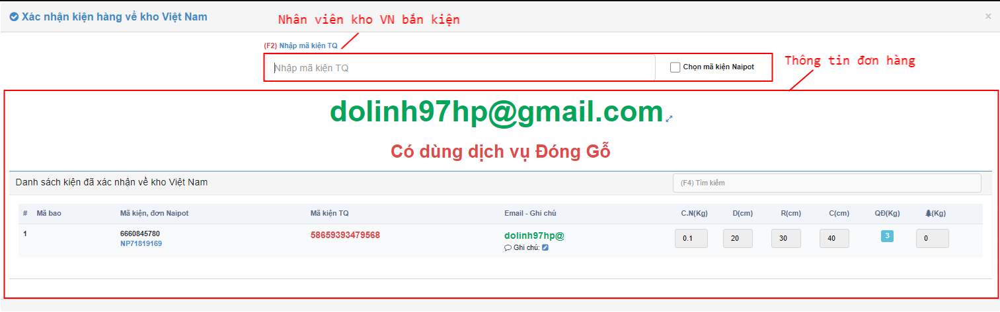
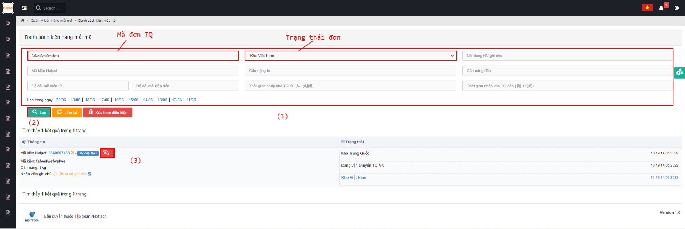
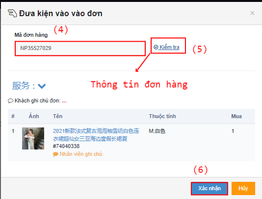

# 🥲 Hướng dẫn nhập hàng về kho VN


Sau khi hàng được vận chuyển từ Trung Quốc về đến kho Việt Nam, Nhân viên kho Việt Nam sẽ tiến hành nhận hàng và thao tác nhận hàng trên hệ thống trên màn hình <mark style="color:green;">**Danh sách kiện hàng**</mark>. Muốn đưa kiện hàng về kho Việt Nam, thì trước đó kiện hàng sẽ ở trạng thái  <mark style="color:blue;">**Đang vận chuyển Trung Quốc - Việt Nam**</mark>.


## 1, <mark style="color:purple;">**Luồng có mã**</mark>&#x20;

### 1.1, Ở màn <mark style="color:green;">**Danh sách kiện hàng**</mark> Nhân viên kho VN sẽ tiến hành chọn kiện hàng muốn đưa về và  đang ở trạng thái <mark style="color:blue;">**Đang vận chuyển TQ-VN**</mark> <mark style="color:red;">**(1)**</mark>** ** => Bấm <mark style="color:red;">**Xác nhận kiện hàng về kho Việt Nam**</mark> <mark style="color:red;">**(2)**</mark>.

&#x20;


Trong trường hợp các đơn lẻ, có thể sử dụng phím  <mark style="color:blue;">**Kho VN nhận.**</mark>


Hệ thống tự động hiển thị lên popup Xác nhận kiện hàng về kho Việt Nam: &#x20;

&#x20;


Chú ý: Trong popup cũng thể hiện 2 chi tiết :

\+ Số kiện hàng có trong bao

\+Số kiện hàng đã được xác nhận về kho Việt Nam.


&#x20;


Khi thao tác Enter để xác nhận kiện hàng về kho Việt Nam thì đồng nghĩa với việc hệ thống đã tiếp nhận hoàn thành xác nhận kiện hàng về kho Việt Nam-->Hệ thống chuyển trạng thái kiện sang <mark style="color:blue;">**Kho Việt Nam**</mark>.


&#x20;

&#x20;

## 2, <mark style="color:purple;">**Luồng mất mã**</mark>&#x20;

Khi hàng về tới kho Việt Nam ,nhân viên kho Việt Nam xếp hàng lên kệ thì phát hiện có kiện hàng bị rách,hỏng,mất mã . Nhân viên kho sẽ thao tác như sau :

### 2.1 Ở màn <mark style="color:green;">**Danh sách kiện hàng mất mã**</mark>, Lọc thông tin kiện hàng mất mã <mark style="color:red;">**(1)**</mark> => Bấm <mark style="color:red;">**Lọc (2)**</mark> => Bấm <mark style="color:blue;">**icon tương tác đơn hàng**</mark> (3)


Bấm <mark style="color:blue;">**Mã kiện hệ thống**</mark> sẽ hiển thị trang Chi tiết kiện hàng, mã đơn hàng ở log Trao đổi.


&#x20;

Điền mã đơn hàng <mark style="color:red;">**(4)**</mark> => bấm <mark style="color:red;">**Kiểm tra**</mark> <mark style="color:red;">**(5)**</mark> => bấm <mark style="color:red;">**Xác nhân (6)**</mark>.

\=> Đến đây ,nhân viên kho sẽ thao tác tiếp tục như <mark style="color:blue;">**Luồng kiện hàng có mã**</mark> .
