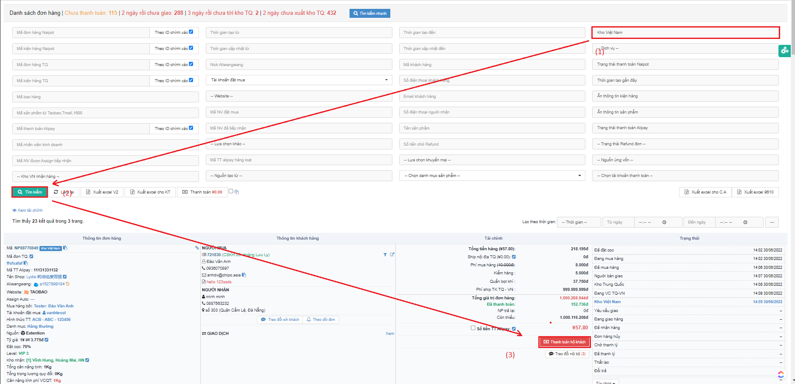
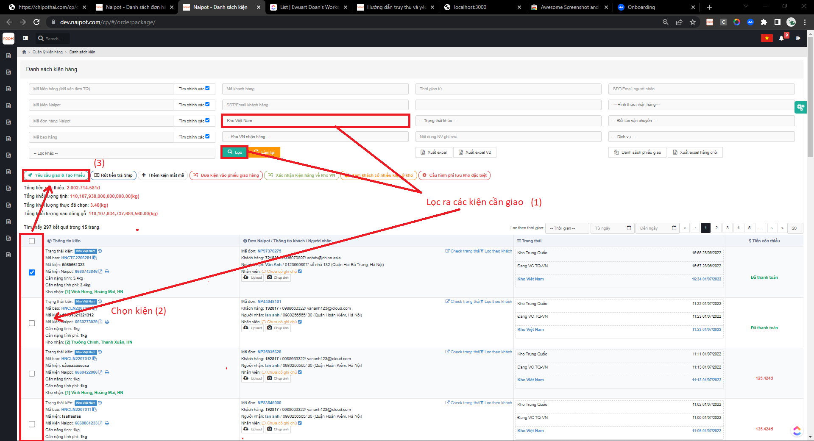
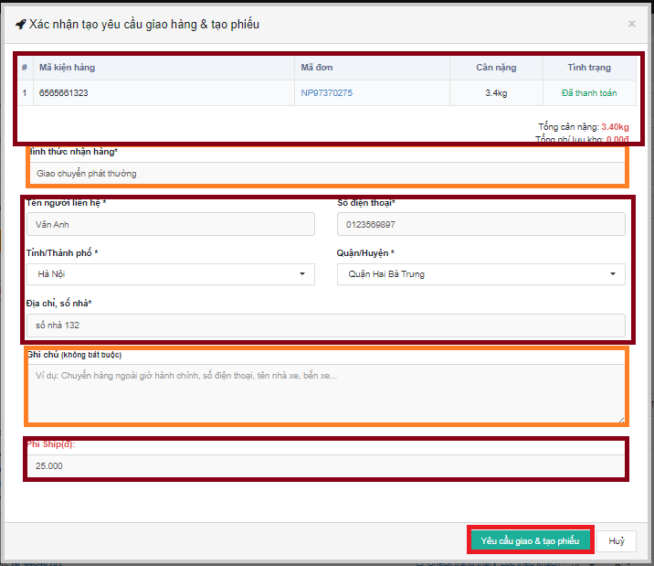
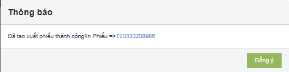

# 😚 Hướng dẫn truy thu và tạo yêu cầu giao hộ khách

## <mark style="color:purple;">**1,**</mark> Ở màn hình <mark style="color:purple;">****</mark>** **<mark style="color:green;">**Danh sách đơn hàng**</mark>**,** chọn đơn ở <mark style="color:green;">****</mark>** **<mark style="color:red;">**Kho Việt Nam(1)**</mark>** **<mark style="color:green;">**=>**</mark> bấm ** **<mark style="color:red;">**Tìm kiếm (2)**</mark>** **<mark style="color:green;">**=>**</mark> bấm <mark style="color:green;">****</mark>** **<mark style="color:red;">**Thanh toán hộ khách (3)**</mark>** **<mark style="color:purple;">****</mark>** :**

## <mark style="color:purple;">**2,**</mark> Ở màn <mark style="color:green;">Danh Sách Kiện Hàng</mark>,lọc kiện <mark style="color:red;">(1)</mark> => chọn kiện muốn giao <mark style="color:red;">(2)</mark> => <mark style="color:red;">Bấm Yêu cầu giao và Tạo phiếu (3)</mark> &#x20;

#### Pop-up <mark style="color:blue;">Xác nhận tạo yêu cầu giao hàng và tạo phiếu</mark> xuất hiện, Điền phần thông tin (<mark style="color:yellow;">phần màu cam</mark>), kiểm tra thông tin (<mark style="color:orange;">phần màu nâu</mark>)  => Bấm <mark style="color:red;">Yêu cầu giao và tạo phiếu</mark>:

## <mark style="color:purple;">3,</mark>Tại màn <mark style="color:green;">Danh sách phiếu giao hàng</mark>, <mark style="color:red;">Bấm</mark> <mark style="color:red;"></mark><mark style="color:red;">**Xác nhận xuất phiếu đóng hàng**</mark>** ** => <mark style="color:red;">**Xác nhận**</mark>

.png>)

### Sau khi xác nhận xuất hàng thành công màn hình hệ thống sẽ hiển thị popup sau:

#### **Chọn Đồng ý  => Xác nhận xuất kho:**

.png>)

&#x20;


Chú ý: Đối với 1 số địa chỉ  quá xa thì có thể 1 số hình thức vận chuyển không hợp lệ,KH vui lòng thay đổi hình thức vận chuyển khác.

