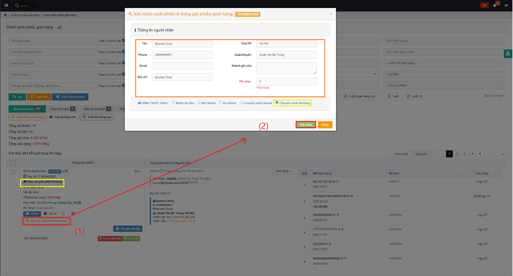
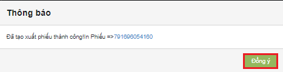
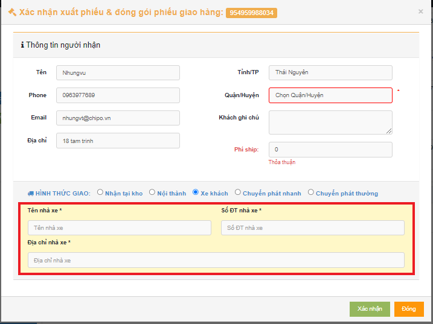
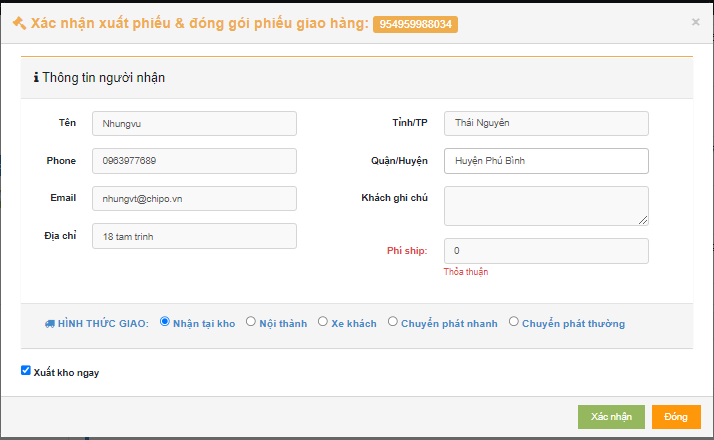

# 😝 Hướng dẫn xuất phiếu giao hàng và xuất kho

Sau khi khách hàng yêu cầu giao và tạo thành phiếu giao hàng thành công ,công việc của nhân viên kho Việt Nam là Xuất Phiếu Giao Hàng và Xuât kho.

## 1, Ở màn hình Danh sách phiếu giao hàng, bấm Xác nhận xuất phiếu giao hàng


Chú ý :&#x20;

Phí ship ( chữ đỏ) sẽ được nhân viên kho sẽ thu và sửa tương ứng:

\+ Nội thành :25.000 VNĐ/1km đầu, tăng thêm 1.000 VNĐ/1km cho mỗi km tăng thêm

\+ Giao nhận tại kho : 0 VNĐ

\+ Các hình thức khác : Thỏa thuận.


Pop-up xuất hiện, kiểm tra thông tin người nhận( màu cam), phương thức vận chuyển( màu vàng) => bấm Xác nhận => Bấm Đồng ý.


Chú ý :

Với hình thức giao xe khách chúng ta cần  có thêm những thông tin như ảnh dưới đây :




Chú ý : Riêng đối với hình thức giao nhận tại kho ,thì nhân viên kho Việt Nam có thể thao tác Xuất phiếu giao hàng ngay => giao hàng



## 2, Ở màn hình Danh sách phiếu giao hàng, bấm Xác nhận xuất kho

